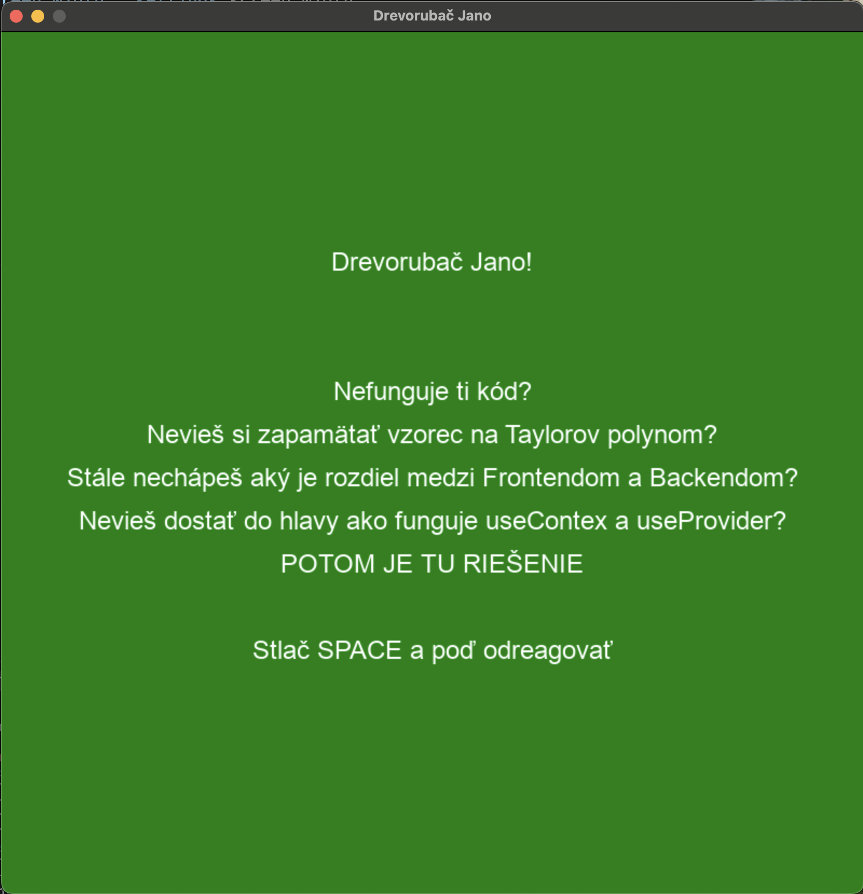
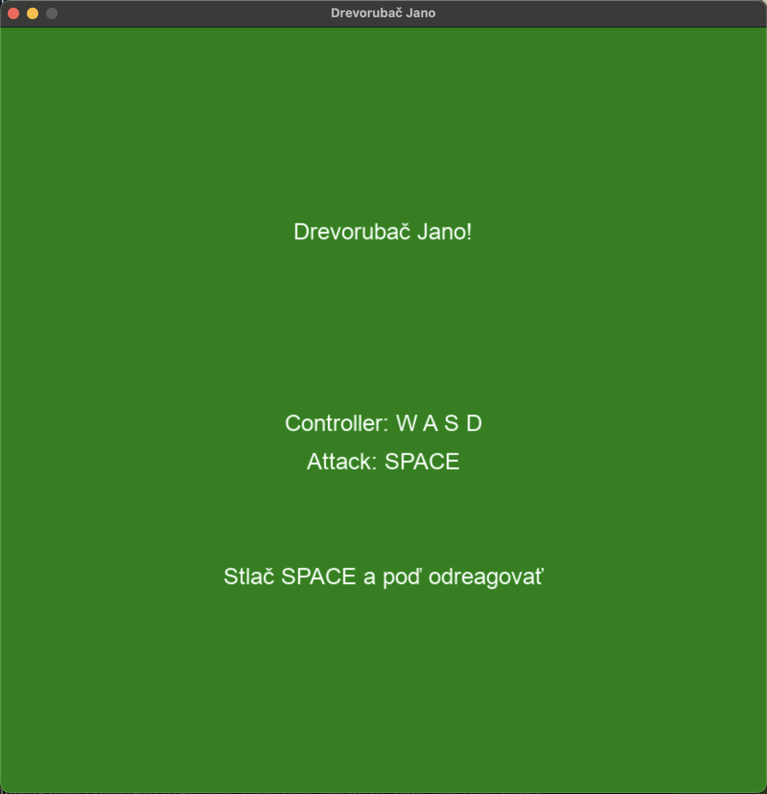
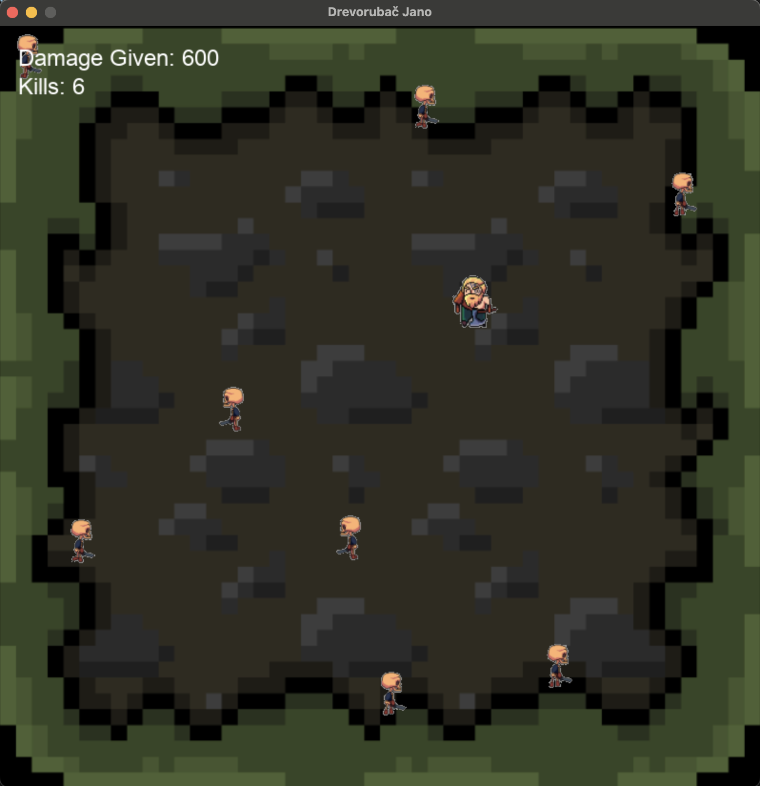
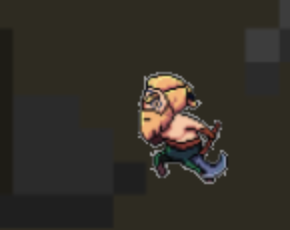
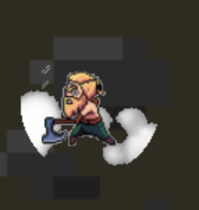

# Jano Drevorubač
Dvojdňový python grafický projekt v pygames

Sprite
+ `Skeleton` - Prechádza sa po mape
+ `Drevorubac` - Jeho úlohou je získať čo najväčší dmg údermi do skeletonov
+ `Drevorubac úder` - Drevorubačova abilita udrieť

### Intro do hry
<br>

### Rýchly a stručný tutorial
<br>

### Mapa so spritemi
<br>

### Beh drevorubača 
<br>

### Údery drevorubača
<br>

Spustenie hry

Naklonovanie git repozitára
```
git clone git@github.com:sknefi/drevorubac-jano.git
```

Vstupenie do repa
```
cd drevorubac-jano
```

Vytvorte virtuálne prostredie 
```
python3 -m venv venv
```

Aktivujte ho: <br> 
na `MacOs`/`Linux`
```
source venv/bin/activate
```
na `Windows`
```
venv\Scripts\activate
```

Nainštalujte `pygames`
```
pip install pygame
```

Spustite hru
```
python3 main.py 
```

Užite si hru 🙂